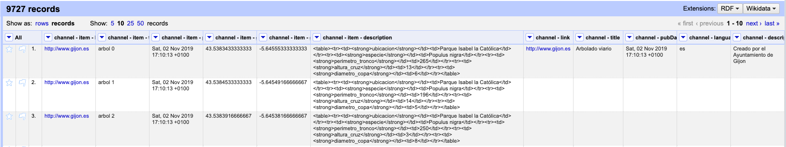
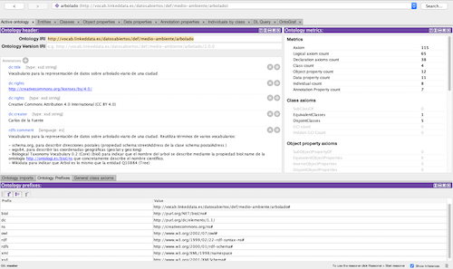
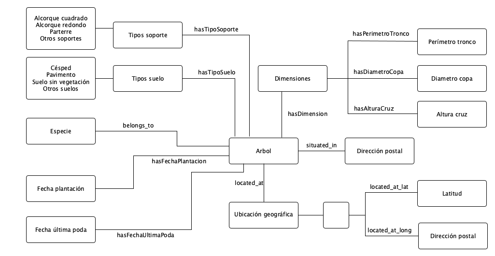
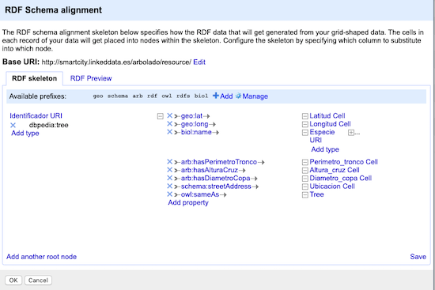
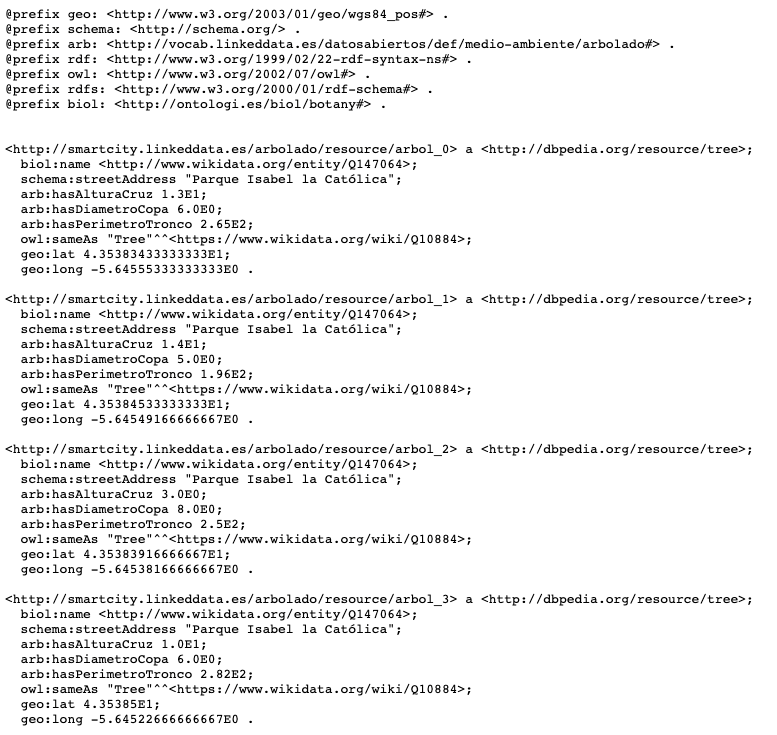

# Práctica Web Semántica y Datos enlazados

## Índice

1. Introducción
2. Proceso de transformación:
	- Selección de la fuente de datos.
	- Análisis de los datos.
	- Estrategia de nombrado
	- Desarrollo del vocabulario.
	- Transformación de datos
	- Enlazado
	- Publicación.
3. Aplicación y explotación.
4. Conclusiones.
5. Bibliografía.


## 1. Introducción

Los Datos Abiertos en el contexto de las Administraciones Públicas son una realidad desde hace aproximadamente 10 años, momento en el que las primeras iniciativas, USA y UK, iniciaron su andadura de apertura de datos que posteriormente fue seguida por numerosos países, regiones y ciudades, alentadas, entre otros movimientos inspiradores, por la [Carta Internacional por los Datos Abiertos](https://opendatacharter.net/), que fomenta los principios fundamentales que cualquier Iniciativa de Datos Abiertos debe asumir, entre ellos, alguno tan sugerente -a la par que  difícil de alcanzar-, como el que alienta la apertura por defecto de los datos públicos.

Actualmente, son centenares las iniciativas de Datos Abiertos promovidas desde todos los niveles de Gobierno, que se desarrollan con desigual fortuna en todo el mundo. El foco es dispar, siendo la transparencia o el desarrollo económico a partir de datos, objetivos que no siempre comparten espacio entre las aspiraciones de los Gobiernos. Muchas de las iniciativas existentes, surgen de la imitación entre Administraciones y adolecen de fuertes debilidades en términos de calidad de datos disponibles. Una de ellas, es la escasa presencia de datos abiertos enlazados en los repositorios institucionales. Esta baja disponibilidad conlleva una exigua reutilización de este tipo de datos por parte del sector infomediario. 

No obstante, el escenario de apertura existente, con mucho camino aún por recorrer, es un proceso que forma parte de la inevitable y progresiva transformación estructural de las Administraciones, por tanto, los Datos Abiertos de Gobierno son una fuente esencial de datos con origen en organismos oficiales.

Para el desarrollo de este trabajo se ha seleccionado un ámbito de aplicación relacionado con el contexto Smart City, como es el del **arbolado viario de una ciudad**. 

Una motivación para realizar esta elección es la carencia de una ontología específica en esta materia entre las existentes en la relación de [vocabularios para Datos Abiertos de Ciudades](http://vocab.linkeddata.es/datosabiertos/), si bien existe una [propuesta](https://github.com/opencitydata/medio-ambiente-arbolado) pendiente de implementar. En base a lo anterior, se aprovecha este ejercicio para implementar dicha propuesta de ontología de arbolado viario.

Además se ha estudiado la existencia de conjuntos de datos abiertos de arbolado viario en diferentes catálogos de datos abiertos del ámbito municipal con el fin de verificar si se trata de un conjunto de datos habitual en estos repositorios de datos. Así, se ha visto que ciudades como Gijón, Barcelona, Sevilla, Rivas-Vaciamadrid y otras ciudades, incluyen el mencionado conjunto de datos en sus respectivos catálogos. Se ha seleccionado el conjunto de datos de la ciudad de Gijón para implementar las tareas del ejercicio.

A continuación, se expone la secuencia de tareas a realizar para alcanzar el objetivo de esta práctica:

## 2. Proceso de transformación

### 2.1. Selección de la fuente de datos

Requisitos que debe satisfacer la fuente de datos:

* Datos Abiertos
* Escenario real
* Disponer de una licencia apta para la reutilización
* Datos accesibles (descargables como archivo de datos o accesible vía API)
* Datos procesables (por ejemplo a través de un formato CSV o JSON)
* Datos actualizados
* Datos enlazables (al menos uno de sus atributos)
* Datos transformables en RDF
* Además que sea un dataset común a varios municipios. 

A partir de estos requisitos, se observa en diversos catálogos municipales de Datos Abiertos, la posible existencia de datasets con estas características relacionados con el ámbito de aplicación elegido: arbolado viario de una ciudad. Se comprueba que existen conjuntos de datos similares en, al menos, los siguientes catálogos de Datos Abiertos:

* [Gijón](http://transparencia.gijon.es/risp_datasets/show/arbolado)
* [Barcelona](https://opendata-ajuntament.barcelona.cat/data/es/dataset/arbrat-viari)
* [Sevilla](http://sevilla-idesevilla.opendata.arcgis.com/datasets/f3393590cea54e3da883f30a27e8a1fd_0)
* [Madrid](https://datos.madrid.es/egob/catalogo/300264-0-Arbolado-parques-historico)
* [Rivas Vaciamadrid](https://datosabiertos.rivasciudad.es/dataset/arbolado)

En función de los requisitos establecidos, se elige la siguiente opción:

* Fuente de datos: transparencia.gijon.es
* Escenario real: datos del arbolado viario
* Dataset: http://transparencia.gijon.es/risp_datasets/show/arbolado
* Publicador: Ayuntamiento de Gijón
* Frecuencia de actualización: Actualizados a fecha Noviembre de 2019 (frecuencia mensual desde junio de 2013).
* Datos reutilizables: CC-BY 3.0
* Datos procesables: dataset disponible en los formatos GeoRSS, KML y RSS.
* Datos enlazables: un atributo se puede enlazar con una taxonomia de especies arbóreas.

#### Análisis de la licencia de los datos

El dataset seleccionado es perfectamente reutilizable en base a la condiciones de la licencia que incorpora.

Licencia: Creative Commons Reconocimiento 3.0 España: Libertad para compartir, adaptar, reutilizar, incluso con fines comerciales, bajo condiciones de reconocimiento de autoría y sin la posibilidad de aplicar restricciones o términos legales que restrinjan aquello que la licencia permite. https://creativecommons.org/licenses/by/3.0/es/

### 2.2.- Análisis de la fuente de datos. 

Formato de datos seleccionado para su descarga y posterior tratamiento: GeoRSS.



El dataset archivo de datos presenta las siguientes características:

* Número de registros: 9.727
* Estructura:

| Nombre de campo | Tipo | Descripción |
| -- | -- | -- |
| channel - item - link | string | Contiene un valor único para todos los registros: www.gijon.es |
| channel - item - title | string | Nombre del item de la forma 'arbol 0'. 'arbol 1', 'arbol, 2', etc. |
channel - item - pubDate | date | Contiene el valor correspondiente a la fecha de publicación del dataset, donde el valor del primer registro es 'Sat, 02 Nov 2019 17:10:13 +0100' y el del último 'Sat, 02 Nov 2019 17:10:15 +0100', Por tanto, entre el primer valor y el último hay una diferencia de 2 segundos. |
| channel - item - geo:lat | decimal | Contiene el valor de la latitud del punto geográfico donde se sitúa el item. |
| channel - item - geo:long  | decimal | Contiene el valor de la longitud del punto geográfico donde se sitúa el item. |
| channel - item - description | string | Contiene en cada valor como código HTML (tabla) con los siguientes contenidos: ubicación (dirección postal), especie, perimetro_tronco, altura_cruz y diametro_copa. |
| channel - link | string | Contiene un único valor tan solo en el primer registro: "http://www.gijon.es" |
| channel - title | string | Contiene un único valor tan solo en el primer registro: "Arbolado viario" |
| channel - pubDate | string | Contiene un único valor tan solo en el primer registro: "Sat, 02 Nov 2019 17:10:13 +0100" |
| channel - language | string | Contiene un único valor tan solo en el primer registro: "es" |
| channel - description | string | Contiene un único valor tan solo en el primer registro: "Creado por el Ayuntamiento de Gijón" |

Según el contenido de los campos, se seleccionan aquellos que realmente aportan información quedando la siguiente estructura de campos preparada, para aplicar las transformaciones que sean requeridas, de la siguiente manera:

| Nombre de campo | Tipo | Descripción |
| -- | -- | -- |
| channel - item - title | string | Nombre del item de la forma 'arbol 0'. 'arbol 1', 'arbol, 2', etc. |
| channel - item - geo:lat | decimal | Contiene el valor de la latitud del punto geográfico donde se situa el item. |
| channel - item - geo:long  | decimal | Contiene el valor de la longitud del punto geográfico donde se situa el item. |
| channel - item - description | string | Contiene en cada valor como código HTML (tabla) con los siguientes contenidos: ubicación (dirección postal), especie, perimetro_tronco, altura_cruz y diametro_copa. |

Características de los campos de la tabla de datos:

* El campo 'channel - item - title' es único para cada registro de la tabla de datos, por tanto, será el identificador de cada ítem.
características (rangos, ...) de los datos y su estructura (además, identificación de conceptos claves del dominio y relaciones entre ellos).
* El campo 'channel - item - description' requiere la aplicación de varias transformaciones.
* No contiene valores desconocidos.
* El dataset no incluye información sobre las unidades de medida.

Entre los metadatos del dataset no se incluye un diccionario de datos que describa su estructura. Por tanto, es necesario deducir ésta del propio conjunto de datos.

* Cada elemento de la tabla está identificado por un identificador único ('channel - item - title').
* Cada árbol pertenece a una especie.
* Cada árbol, está ubicado en una dirección postal que se corresponde con una coordenada geográfica, y posee una medidas cuyos valores se corresponden con tres atributos: perímetro_tronco, altura_cruz y diámetro_copa.

### 2.3.- Estrategia de nombrado

#### 2.3.1.- Elección del formato de URIs:

Dado que el conjunto de datos contiene un número significativo de observaciones y seguiría creciendo con la disponibilidad de más datos, es apropiado definir las URIs de los individuos usando slash URIs (/) con redirecciones a documentos genéricos (a tener en cuenta que se requerirá redireccionamiento 303 y negociación de contenido). Para el modelo ontológico, más pequeño, usaré hash URIs (#). Por tanto:

#### 2.3.2.- Elección de dominio y path para las URIs, para formar la base de las URIs

Teniendo en cuenta que existe la propuesta de [ontología de arbolado](https://github.com/opencitydata/medio-ambiente-arbolado) mencionada anteriormente pero sin implementación, se toma como base para el desarrollo de esta práctica. Por tanto, la base de las URIs elegida para el modelo ontológico y los datos es: http://smartcity.linkeddata.es/arbolado/

Aspectos claves de esta etapa son: i) desambiguación: una URI debe identificar un único ítem. y ii) las URIs debe ser persistentes y no deben contener nada que pueda cambiar (por ejemplo, información sobre el estado del recurso). Es posible lograr esto último usando PURL (Persistent Uniform Resources Locator).

#### 2.3.3.- Elección de un patrón para las clases y propiedades de la ontología, igualmente para los individuos.

El patrón de URIs, tomando como base la seleccionada será:

* URI de los recursos: http://smartcity.linkeddata.es/arbolado/resource/
* URI de la ontología: http://vocab.linkeddata.es/datosabiertos/def/medio-ambiente/arbolado

Ruta para términos ontológicos: 

- Las clases tendrán la forma: /ontology/\<ontologyName>#\<className>
- Las propiedades tendrán la forma: /ontology/\<ontologyName>#\<propertyName>

Concretamente:

* Clases: http://vocab.linkeddata.es/datosabiertos/def/medio-ambiente/arbolado#Arbol
* Propiedades: http://vocab.linkeddata.es/datosabiertos/def/medio-ambiente/arbolado#hasName

Las instancias en la ontología tendrán la forma:

- Instancias: /resource/\<className>/\<identifier>

Concretamente:

Ruta para individuos: http://smartcity.linkeddata.es/arbolado/resource/Arbol/arbol_0


### 2.4.- Desarrollo del vocabulario

#### 2.4.1.- Requisitos que debe satisfacer la ontología

El primer paso es determinar el objetivo y alcance de la ontología tratando de responder a las siguientes cuestiones:

* ¿Cuál es el dominio que la ontología cubrirá?

El dominio de información que abarcará los términos que se definan en este vocabulario será el referido al arbolado viario de una ciudad y se enmarcará dentro de la temática o sector de Medio Ambiente de la taxonomía de sectores primarios definida en la Norma Técnica de Interoperabilidad (NTI) de recursos de información. 

* ¿Cuál será el uso de la ontología?

El propósito de este vocabulario es representar la información relacionada con el arbolado viario de una ciudad (ubicación, especie, dimensiones, fecha de plantación, fecha de poda, etc.), Los archivos que contienen estos datos son mantenidos por los Ayuntamientos.

* ¿Para qué tipos de preguntas la ontología deberá dar respuestas?

Debe responder a preguntas del tipo:

¿Es posible obtener una descripción ampliada de cada especie de arbolado?
¿Es posible obtener una mediante una representación cartográfica la ubicación donde se encuentra cada árbol?
¿Es posible conocer aspectos del cuidado y mantenimiento de cada árbol de un municipio (poda, soporte, etc.)?
¿es posible utilizar un vocabulario estándar para la representación de las coordenadas geográficas?
¿Es posible, en función de las dimensiones de cada árbol, emplear una fórmula para calcular la superficie de sombra?

* ¿Quién usará y mantendrá la ontología?

La ontología será utilizada por los Ayuntamientos publicadores de Datos Abiertos en sus respectivos catálogos y puede ser mantenida por el Grupo de Trabajo de Datos Abiertos creado por la FEMP al amparo del trabajo ["Datos Abiertos: Guía estratégica para su puesta en marcha. Conjuntos de datos mínimos a publicar"](http://femp.femp.es/files/3580-1617-fichero/Gu%C3%ADa%20Datos%20Abiertos.pdf). 


Por otro lado, se debe tener en cuenta, como requisito no funcional para la implementación de la ontología, la existencia de vocabularios reutilizables.



#### 2.4.2.- Extracción de términos del esquema de datos y de los datos

Del modelo de datos subyacente al conjunto seleccionado para esta práctica se obtiene la siguiente relación de recursos principales:

* Identificador del árbol
* Especie arbórea
* Ubicación (Coordenadas geográficas: latitud, longitud)
* Dirección postal
* Dimensiones de árboles

Existen las siguientes relaciones entre recursos:

* Cada árbol pertenece a una especie.
* Cada árbol se encuentra en una ubicación (coordenada) concreta.
* Cada árbol se encuentra frente a una dirección postal (aproximada).
* Cada árbol tiene unas dimensiones
* Las dimensiones se determinan por los atributos: perímetro_tronco, altura_cruz y diámetro_copa.
* Cada árbol tiene unas dimensiones
* Las unidades de medida de perimetro_tronco son centímetros
* Las unidades de medida de altura: altura_cruz y diametro_copa son metros.

Por otro lado, el estudio de los campos incluidos en los diferentes ejemplos de conjuntos de datos publicados en los catálogos de Datos Abiertos municipales mencionados anteriormente, arroja la siguiente propuesta de campos mínimos:

* Identificador del árbol
* Nombre científico
* Ubicación (Coordenadas Latitud, Longitud)
* Dirección postal
* Fecha de plantación
* Fecha de última poda
* Dimensiones del árbol (perímetro tronco, diámetro copa, altura cruz)
* Tipo de soporte (parterre, alcorque cuadrado, alcorque redondo, otros)
* Dimensiones del alcorque
* Tipo de suelo (pavimento, césped, suelo sin vegetación, otros)

#### 2.4.3.- Definición del modelo ontológico

El modelo conceptual ontológico que se puede extraer del modelo de datos subyacente al conjunto seleccionado para esta práctica es el siguiente:



#### 2.4.4.- Búsqueda de Ontologías reutilizables

La búsqueda se realiza principalmente en Linked Open Vocabularies (LOV) donde se observa la oportunidad para reutilizar las siguientes ontologías que tienen relación con la ontología a implementar en la práctica

* schema.org, se puede utilizar para describir direcciones postales (schema:postalAdress tiene la propiedad schema:streetAddress)
* wikidata, se puede utilizar para describir la clase 'árbol' equivalente a la clase ['tree'](https://www.wikidata.org/wiki/Q10884).
* Biological Taxonomy Vocabulary 0.2 (Core) (biol) se puede utilizar para describir las especies botánicas a través de su nombre científico (biol:name).
* las propiedades geo:lat y geo:long del vocabulario WGS84 (wsg84_pos:SpatialThing), se pueden usar para describir las coordenadas geográficas.
* xsd datatypes (xsd:decimal) se puede usar para describir los valores de las dimensiones determinadas por los atributos: perímetro_tronco, altura_cruz y diámetro_copa.

#### 2.4.5.- Reutilización de ontologías y/o elementos en las ontologías encontradas en el paso previo

Criterios de selección para la reutilización de ontologías:

i) la semántica de una clase o propiedad en la ontología está relacionada con el término de búsqueda
ii) si el término se relaciona con una clase, la clase en la ontología tiene tantas propiedades que se correlacionan con el término como sea posible.
iii) la ontología que describe la clase o propiedad relacionada con el término de búsqueda está ampliamente aceptada y utilizada.

Según lo anterior se reutilizarán las ontologías:

* Wikidata
* schema.org
* biol
* WGS84

#### 2.4.6.- Implementación de la ontología

Para afrontar esta tarea se utiliza el editor de ontologías: Protégé V.5.5.0

De acuerdo a un lenguaje de implementación de ontologías y siguiendo la estrategia de nombrado de recursos.

Este paso se realiza a través de una integración ontológica, es decir, integración de conceptos de la ontología seleccionada. Esto se hace, o bien, importando la ontología a ser reutilizada en la ontología que está siendo desarrollada o referenciando a URIs de elementos tal que solo esas referencias se incluyan en la ontología que se está implementando.

En nuestro ejemplo, la integración se lleva a cabo referenciando a URIs de elementos.

#### 2.4.7.- Evaluación de la ontología

Para validar la sintaxis de la ontología se utiliza la herramienta [OOPS!](http://oops.linkeddata.es/)

El resultado de la evaluación en OOPS! indica:

* Results for P08: Missing annotations.22 cases | Minor Minor
* Results for P13: Inverse relationships not explicitly declared.12 cases | Minor Minor
* According to the highest importance level of pitfall found in your ontology the conformace bagde suggested is "Minor pitfalls"

Y por tanto se podría usar el siguiente logo para indicar el estado de la ontología en la pagina de documentación de la misma:


### 2.5.- Transformación de datos

La serialización en RDF que se utilizará para transformar los datos es RDF Turtle. La herramienta para realizar las transformaciones es OpenRefine V.3.2 con la extensión RDF V.1.1.4 sobre MacOs.

Antes de realizar el mapping entre los datos de origen y la ontología es necesario aplicar una serie de transformaciones para preparar los datos adecuadamente.

#### 2.5.1.- Transformaciones sobre OpenRefine

A continuación se detallan las tareas que se realizan sobre el conjunto de datos.

T.1.- Eliminar columnas que no aportan información relevante

rss - channel - item - pubDate, es el campo que recoge la fecha de actualización de cada registro correspondiente al 'Sat, 02 Nov 2019 17:10:13 +0100'. Se elimina porque después de obtener una vista facetada de valores se observa que se obtienen tres valores diferentes con una diferencia de 1 segundo.

Otras columnas que se eliminan:

column rss - version
column rss - channel - item - link
column rss - channel - title
column rss - channel - pubdate
column rss - channel - link
column rss - channel - language

T.2.- Sobre la columna 'column rss - channel - item - description', cuyo contenido en el primer registro contiene lo siguiente: 

<table><tr><td><strong>ubicacion</strong></td><td>Parque Isabel la Católica</td></tr><tr><td><strong>especie</strong></td><td>Populus nigra</td></tr><tr><td><strong>perimetro_tronco</strong></td><td>265</td></tr><tr><td><strong>altura_cruz</strong></td><td>13</td></tr><tr><td><strong>diametro_copa</strong></td><td>6</td></tr></table>

Se aplican las siguientes transformaciones:
 
T.2.1.- Split 9727 cell(s) in column rss - channel - item - description into several columns by separator

T.2.2.- Sobre la columna: rss - channel - item - description 2

substring(value, 27, lastIndexOf(value,"</td>")) genera la columna: Ubicación

T.2.3.- Sobre la columna: rss - channel - item - description 3

substring(value, 25, lastIndexOf(value,"</td>")) genera la columna: Especie

T.2.4.- Sobre la columna: rss - channel - item - description 4

substring(value, 34, lastIndexOf(value,"</td>")) genera la columna: Perimetro_tronco

T.2.5.- Sobre la columna: rss - channel - item - description 5

substring(value, 29, lastIndexOf(value,"</td>")) genera la columna: Altura_cruz

T.2.6.- Sobre la columna: rss - channel - item - description 6

substring(value, 31, lastIndexOf(value,"</td>")) genera la columna: Diametro_Copa

T.3.- Se eliminan las columnas:

rss - channel - item - description 2
rss - channel - item - description 3
rss - channel - item - description 4
rss - channel - item - description 5
rss - channel - item - description 6

T.4. Renombrado de columnas:

rss - channel - item - title --> Identificador
rss - channel - item - geo:lat --> Latitud
rss - channel - item - geo:long --> Longitud

T.5.- Transformar valores de celdas de las columnas Latitud, Longitud, Perimetro_tronco, Altura_cruz, Diametro_Copa a valores numéricos.

T.6.- Aplicar a la columna 'identificador', la siguiente transformación para generar un formato de identificador sin espacios:

replace(value, " ", "_")

La transformación resultante se representa en la siguiente imagen:


Posteriormente, se realizará el mapeo entre este nueva tabla de datos y la ontología, que permitirá el nombrado de todas las instancias en el dataset de acuerdo a la estrategia de nombrado definida.

En esta etapa se trata, además, de aplicar buenas prácticas siempre que sea posible: evitar blank nodes, usar HTTP URIs, usar URIs externas, incluir enlaces owl:sameAs y reutilizar términos existentes.

En primer lugar, se selecciona como identificador único del conjunto de datos el atributo "Identificador" que será utilizado para construir las URIs de cada recurso. Esta decisión se toma estudiando las facetas de texto de dicho campo y se observa que efectivamente se trata de valores únicos para cada uno de los registros (arbol_0, arbol_1, arbol_2, ... arbol_9727).

El esqueleto RDF se edita en base a los siguientes pasos:

P1.- Incluir en el mapeo la estrategia de nombrado de recursos definida en el proceso 2.3 de esta memoria. El patrón definido para los términos ontológicos se añade incluyendo el prefijo siguiente: 

arb	http://vocab.linkeddata.es/datosabiertos/def/medio-ambiente/arbolado#

Como la ontología aún no está publicada se fuerza la importación para evitar errores en su utilización.

Para los individuos indicamos la siguiente base URI: http://smartcity.linkeddata.es/arbolado/resource/

En este paso se añaden otros prefijos que serán utilizados durante el mapeo a los que tenemos por defecto (rdf, rdfs y owl):

* geo		http://www.w3.org/2003/01/geo/wgs84_pos#
* schema	http://schema.org/
* biol		http://ontologi.es/biol/botany#
* dbpedia	http://dbpedia.org/resource/

P2.- El esqueleto RDF se construye añadiendo las siguientes recursos:

En primer lugar, se implementa el patrón de nombrado para los individuos:

'Identificador' content used 'URI' use expression value

Indicamos además que los individuos identificados mediante esta URI son del tipo dbpedia:tree


Análogamente, se añaden propiedades:

| Propiedad | Configuración de valor |
| -- | -- |
| channel - item - title | string | Nombre del item de la forma 'arbol 0'. 'arbol 1', 'arbol, 2', etc. |
| geo:lat | 'Latitud' content used 'Non-integer' use expression 'value' |
| geo:long | 'Longitud' content used 'Non-integer' use expression 'value' |
| biol:name | 'Especie' content used 'URI' use expression '"http://www.wikidata.org/entity/"+cell.recon.match.id' |
| arb:hasPerimetroTronco | 'Perimetro_tronco' content used 'Non-integer' use expression 'value' |
| arb:hasAlturaCruz | 'Altura_cruz' content used 'Non-integer' use expression 'value' |
| arb:hasDiametroCopa | 'Diametro_copa' content used 'Non-integer' use expression 'value' |
| sowl:sameAs | Constant value 'Tree' custom (specify type URI) 'https://www.wikidata.org/wiki/Q10884' |



Una vez realizado el proceso anterior, es posible exportar la serialización en RDF generada



Por último, se procede a la evaluación del dataset en RDF obtenido. Para ello, se realiza una validación sintáctica usando la herramienta RDF [Validata](https://www.w3.org/2015/03/ShExValidata/) de W3C. Se obtiene el siguiente resultado de la validación:


### 2.6.- Enlazado

La tarea de enlazado se realizará utilizando el servicio de reconciliación de la extensión RDF para OpenRefine contra el servicio de reconciliación de Wikidata.

El primer paso es identificar clases cuyas instancias puedan ser el sujeto del enlace y el segundo paso es identificar datasets que pueden contener instancias para las clases previamente identificadas.

En este caso, ser realizará una alineación por valores, la clase a enlazar será 'Especie' y se enlazará con el nombre cientifico de la especie arbórea definida en Wikidata, 'taxon name'.

Este proceso nos define la URL que define cada especie en Wikidata y que hemos añadido en el esqueleto RDFn mencionado anteriormente:

'Especie' content used 'URI' use expression '"http://www.wikidata.org/entity/"+cell.recon.match.id'

El proceso de reconciliación de valores requiere, además, la corrección de algunos ítems con nombres erróneos. Por ejemplo, se sustituye: 'Junglans regia' por 'Juglans regia', 'Hulmus minor' por 'Ulmus minor', 'Cassuarina cunninghamiana' por 'Casuarina cunninghamiana', 'Hibiscus syracus' por 'Hibiscus syriacus' 'Ilex aquilifolium' por 'Ilex aquifolium' y otros errores del mismo estilo. También se edita 'Cedrus deodara o atlantica' por 'Cedrus deodara'. Igualmente se encuentra alguna especie cuya denominación es 'desconocido 6.2', 'Fraxinus americana verificar' o 'Liriodendron tulipifera KO' que se puede sobreentender que por alguna imprecisión están en pendientes de revisión por parte de los responsables del dataset. Por último algunas especies incluyen nombres del estilo 'Carpinus betulus var. fastigiata'

Nota curiosa: se encuentra una especie ('Arbol_9724') que se llama 'Parking autoctonus' situada en el 'Parque Científico-Tecnológico' ;-)

Tras este proceso se ha reconciliado el **99,84%** de los valores. No ha sido posible reconciliar:

545.	desconocido 6.2
609.	Fraxinus americana verificar
610.	Fraxinus americana verificar
769.	Catalpa pendula comprobar
1053.	Citrus sp
1109.	Morera 10.3
3049.	Tilia muerto
3106.	Tilia muerto
3380.	Fagys sylvatica
3602.	Saphora japonica
3615.	Desconocida
3616.	Desconocida
3622.	Taxus bacatta
3748.	Desconocida
9725.	Parking autoctonus
9726.	Saulensis Rotensius


### 2.7.- Publicación

La publicación se realiza en DataHub.io, previo registro. Pasos que se siguen:

#### 2.7.1.- Registro.

Login de usuario y acceso.

#### 2.7.2.- Descarga, instalación y comprobación del funcionamiento de la herramienta de publicación para MacOS.

```
gunzip -f data-macos.gz
chmod +x data-macos
sudo mv data-macos /usr/local/bin/data
data --version
```
    
#### 2.7.3.- Ejecución del comando de publicación

```
data login
data push arbolado_viario_gijon.ttl

your data is published!
https://datahub.io/carlosdlfuente/arbolado_viario_gijon/v/1

```

## 3.- Aplicación y explotación

La [aplicación](../aplicacion/) que explota los datos enlazados del conjunto transformado, se desarrolla usando la API de JENA sobre la IDE de Eclipse.  

El objetivo de la aplicación es obtener información sobre características específicas de ejemplares de especies arbóreas de la ciudad de Gijón.

A continuación se detallan los diferentes casos de uso que contempla la aplicación y la query SPARQL que se plantea para resolver cada consulta :

* Caso 1: Obtener los nombres científicos de todos los árboles de la ciudad

		String queryString = 
				"PREFIX biol: <http://ontologi.es/biol/botany#>" +
				"SELECT ?arbol ?nombre_cientifico " +
				"WHERE {?arbol biol:name ?nombre_cientifico.}" +
				"LIMIT 10";

Salida:

Arbol: http://smartcity.linkeddata.es/arbolado/resource/arbol_796 --> Nombre cientifico: http://www.wikidata.org/entity/Q147064
Arbol: http://smartcity.linkeddata.es/arbolado/resource/arbol_6874 --> Nombre cientifico: http://www.wikidata.org/entity/Q158776
Arbol: http://smartcity.linkeddata.es/arbolado/resource/arbol_8276 --> Nombre cientifico: http://www.wikidata.org/entity/Q255375
Arbol: http://smartcity.linkeddata.es/arbolado/resource/arbol_7236 --> Nombre cientifico: http://www.wikidata.org/entity/Q158746
Arbol: http://smartcity.linkeddata.es/arbolado/resource/arbol_3074 --> Nombre cientifico: http://www.wikidata.org/entity/Q156831
Arbol: http://smartcity.linkeddata.es/arbolado/resource/arbol_9263 --> Nombre cientifico: http://www.wikidata.org/entity/Q732933
Arbol: http://smartcity.linkeddata.es/arbolado/resource/arbol_7302 --> Nombre cientifico: http://www.wikidata.org/entity/Q159657
Arbol: http://smartcity.linkeddata.es/arbolado/resource/arbol_2227 --> Nombre cientifico: http://www.wikidata.org/entity/Q158785
Arbol: http://smartcity.linkeddata.es/arbolado/resource/arbol_4825 --> Nombre cientifico: http://www.wikidata.org/entity/Q17579300
Arbol: http://smartcity.linkeddata.es/arbolado/resource/arbol_1386 --> Nombre cientifico: http://www.wikidata.org/entity/Q255375

* Caso 2: Obtener la situación de todos los árboles de la ciudad

		String queryString2 = 
				"PREFIX schema: <http://schema.org/> " +
				"PREFIX geo: <http://www.w3.org/2003/01/geo/wgs84_pos#> " +
				"SELECT ?arbol ?calle ?latitud ?longitud " +
				"WHERE {?arbol schema:streetAddress ?calle;" +
				 " geo:lat ?latitud;" +
				 " geo:long ?longitud.}" +
				"LIMIT 10";
				
Salida:

Arbol: http://smartcity.linkeddata.es/arbolado/resource/arbol_9637 --> Situado en: CALLE RIO EO s/n esqna San Nicolas 74, con las coordenadas: 4.35225283333333E1^^http://www.w3.org/2001/XMLSchema#double, -5.67204E0^^http://www.w3.org/2001/XMLSchema#double
Arbol: http://smartcity.linkeddata.es/arbolado/resource/arbol_9307 --> Situado en: CALLE DOS DE MAYO 10, con las coordenadas: 4.354004E1^^http://www.w3.org/2001/XMLSchema#double, -5.68525833333333E0^^http://www.w3.org/2001/XMLSchema#double
Arbol: http://smartcity.linkeddata.es/arbolado/resource/arbol_4074 --> Situado en: PASEO MARITIMO, con las coordenadas: 4.35475333333333E1^^http://www.w3.org/2001/XMLSchema#double, -5.64201333333333E0^^http://www.w3.org/2001/XMLSchema#double
Arbol: http://smartcity.linkeddata.es/arbolado/resource/arbol_4931 --> Situado en: CALLE LEOPOLDO ALAS, con las coordenadas: 4.35313516666667E1^^http://www.w3.org/2001/XMLSchema#double, -5.65257666666667E0^^http://www.w3.org/2001/XMLSchema#double
Arbol: http://smartcity.linkeddata.es/arbolado/resource/arbol_1006 --> Situado en: Parque Isabel la Católica, con las coordenadas: 4.35388733333333E1^^http://www.w3.org/2001/XMLSchema#double, -5.64398833333333E0^^http://www.w3.org/2001/XMLSchema#double
Arbol: http://smartcity.linkeddata.es/arbolado/resource/arbol_4474 --> Situado en: QUEVEDO 55, con las coordenadas: 4.3531165E1^^http://www.w3.org/2001/XMLSchema#double, -5.64927166666667E0^^http://www.w3.org/2001/XMLSchema#double
Arbol: http://smartcity.linkeddata.es/arbolado/resource/arbol_5698 --> Situado en: AVENIDA DE LA COSTA 5, con las coordenadas: 4.3537455E1^^http://www.w3.org/2001/XMLSchema#double, -5.66405166666667E0^^http://www.w3.org/2001/XMLSchema#double
Arbol: http://smartcity.linkeddata.es/arbolado/resource/arbol_5434 --> Situado en: CALLE URIA 31, con las coordenadas: 4.353846E1^^http://www.w3.org/2001/XMLSchema#double, -5.65532666666667E0^^http://www.w3.org/2001/XMLSchema#double
Arbol: http://smartcity.linkeddata.es/arbolado/resource/arbol_591 --> Situado en: Parque Isabel la Católica, con las coordenadas: 4.35376366666667E1^^http://www.w3.org/2001/XMLSchema#double, -5.641195E0^^http://www.w3.org/2001/XMLSchema#double
Arbol: http://smartcity.linkeddata.es/arbolado/resource/arbol_2390 --> Situado en: CALLE IRENE FERNANDEZ PERERA s/n, con las coordenadas: 4.35199133333333E1^^http://www.w3.org/2001/XMLSchema#double, -5.66876E0^^http://www.w3.org/2001/XMLSchema#double

				
* Caso 3: Obtener los árboles con mayor diámetro de copa y su situación

		String queryString3 = 
				"PREFIX arb: <http://vocab.linkeddata.es/datosabiertos/def/medio-ambiente/arbolado#>" +
				"PREFIX schema: <http://schema.org/> " +
				"SELECT ?arbol ?calle ?diametro " +
				"WHERE {?arbol arb:hasDiametroCopa ?diametro;"
				+ "schema:streetAddress ?calle.}" +
				"ORDER BY DESC(?diametro)" +
				"LIMIT 10";
				
Salida:

Arbol: http://smartcity.linkeddata.es/arbolado/resource/arbol_285 --> Situado en: Parque Isabel la Católica, con diametro de copa: 2.22E2^^http://www.w3.org/2001/XMLSchema#double
Arbol: http://smartcity.linkeddata.es/arbolado/resource/arbol_513 --> Situado en: Parque Isabel la Católica, con diametro de copa: 2.4E1^^http://www.w3.org/2001/XMLSchema#double
Arbol: http://smartcity.linkeddata.es/arbolado/resource/arbol_391 --> Situado en: Parque Isabel la Católica, con diametro de copa: 2.3E1^^http://www.w3.org/2001/XMLSchema#double
Arbol: http://smartcity.linkeddata.es/arbolado/resource/arbol_964 --> Situado en: Parque Isabel la Católica, con diametro de copa: 2.3E1^^http://www.w3.org/2001/XMLSchema#double
Arbol: http://smartcity.linkeddata.es/arbolado/resource/arbol_451 --> Situado en: Parque Isabel la Católica, con diametro de copa: 2.2E1^^http://www.w3.org/2001/XMLSchema#double
Arbol: http://smartcity.linkeddata.es/arbolado/resource/arbol_497 --> Situado en: Parque Isabel la Católica, con diametro de copa: 2.1E1^^http://www.w3.org/2001/XMLSchema#double
Arbol: http://smartcity.linkeddata.es/arbolado/resource/arbol_642 --> Situado en: Parque Isabel la Católica, con diametro de copa: 2.1E1^^http://www.w3.org/2001/XMLSchema#double
Arbol: http://smartcity.linkeddata.es/arbolado/resource/arbol_772 --> Situado en: Parque Isabel la Católica, con diametro de copa: 2.1E1^^http://www.w3.org/2001/XMLSchema#double
Arbol: http://smartcity.linkeddata.es/arbolado/resource/arbol_967 --> Situado en: Parque Isabel la Católica, con diametro de copa: 2.1E1^^http://www.w3.org/2001/XMLSchema#double
Arbol: http://smartcity.linkeddata.es/arbolado/resource/arbol_1253 --> Situado en: Parque Isabel la Católica, con diametro de copa: 2.0E1^^http://www.w3.org/2001/XMLSchema#double


* Caso 4: Obtener todos los nombres y número de árboles distintos y ordenados existentes en el dataset

		String queryString4 = 
				"PREFIX biol: <http://ontologi.es/biol/botany#>" +
				"SELECT ?nombre_cientifico (COUNT(?nombre_cientifico) AS ?count)" +
				"WHERE {?arbol biol:name ?nombre_cientifico} " +
				"GROUP BY ?nombre_cientifico " +
				"ORDER BY DESC(?count) " +
				"LIMIT 20";

Arbol: http://www.wikidata.org/entity/Q1209219 --> Unidades: 1373^^http://www.w3.org/2001/XMLSchema#integer
Arbol: http://www.wikidata.org/entity/Q158746 --> Unidades: 1349^^http://www.w3.org/2001/XMLSchema#integer
Arbol: http://www.wikidata.org/entity/Q158776 --> Unidades: 842^^http://www.w3.org/2001/XMLSchema#integer
Arbol: http://www.wikidata.org/entity/Q255375 --> Unidades: 466^^http://www.w3.org/2001/XMLSchema#integer
Arbol: http://www.wikidata.org/entity/Q218155 --> Unidades: 400^^http://www.w3.org/2001/XMLSchema#integer
Arbol: http://www.wikidata.org/entity/Q161116 --> Unidades: 324^^http://www.w3.org/2001/XMLSchema#integer
Arbol: http://www.wikidata.org/entity/Q163981 --> Unidades: 324^^http://www.w3.org/2001/XMLSchema#integer
Arbol: http://www.wikidata.org/entity/Q158785 --> Unidades: 278^^http://www.w3.org/2001/XMLSchema#integer
Arbol: http://www.wikidata.org/entity/Q17579300 --> Unidades: 273^^http://www.w3.org/2001/XMLSchema#integer
Arbol: http://www.wikidata.org/entity/Q156831 --> Unidades: 266^^http://www.w3.org/2001/XMLSchema#integer
Arbol: http://www.wikidata.org/entity/Q147064 --> Unidades: 261^^http://www.w3.org/2001/XMLSchema#integer
Arbol: http://www.wikidata.org/entity/Q156944 --> Unidades: 251^^http://www.w3.org/2001/XMLSchema#integer
Arbol: http://www.wikidata.org/entity/Q165321 --> Unidades: 237^^http://www.w3.org/2001/XMLSchema#integer
Arbol: http://www.wikidata.org/entity/Q156907 --> Unidades: 168^^http://www.w3.org/2001/XMLSchema#integer
Arbol: http://www.wikidata.org/entity/Q732933 --> Unidades: 166^^http://www.w3.org/2001/XMLSchema#integer
Arbol: http://www.wikidata.org/entity/Q146951 --> Unidades: 146^^http://www.w3.org/2001/XMLSchema#integer
Arbol: http://www.wikidata.org/entity/Q146281 --> Unidades: 141^^http://www.w3.org/2001/XMLSchema#integer
Arbol: http://www.wikidata.org/entity/Q161374 --> Unidades: 140^^http://www.w3.org/2001/XMLSchema#integer
Arbol: http://www.wikidata.org/entity/Q26006 --> Unidades: 132^^http://www.w3.org/2001/XMLSchema#integer
Arbol: http://www.wikidata.org/entity/Q149622 --> Unidades: 128^^http://www.w3.org/2001/XMLSchema#integer

* Caso 5: Obtener todos los árboles con sus nombres científicos de una calle determinada (Por ejemplo: CALLE POLA DE SIERO)

		String queryString5 = 
				"PREFIX schema: <http://schema.org/> " +
				"PREFIX biol: <http://ontologi.es/biol/botany#>" +
				"PREFIX geo: <http://www.w3.org/2003/01/geo/wgs84_pos#> " +
				"SELECT ?arbol ?calle ?nombre_cientifico " +
				"WHERE {?arbol schema:streetAddress ?calle; " +
					"biol:name ?nombre_cientifico ." +
					"FILTER regex(?calle, '^CALLE POLA DE SIERO')}" +
				"LIMIT 10";

Salida:

Arbol: http://smartcity.linkeddata.es/arbolado/resource/arbol_6344 de nombre científico: http://www.wikidata.org/entity/Q159553, situado en:CALLE POLA DE SIERO 9
Arbol: http://smartcity.linkeddata.es/arbolado/resource/arbol_6342 de nombre científico: http://www.wikidata.org/entity/Q161511, situado en:CALLE POLA DE SIERO 5
Arbol: http://smartcity.linkeddata.es/arbolado/resource/arbol_6346 de nombre científico: http://www.wikidata.org/entity/Q159553, situado en:CALLE POLA DE SIERO 13
Arbol: http://smartcity.linkeddata.es/arbolado/resource/arbol_6352 de nombre científico: http://www.wikidata.org/entity/Q159553, situado en:CALLE POLA DE SIERO 10
Arbol: http://smartcity.linkeddata.es/arbolado/resource/arbol_6339 de nombre científico: http://www.wikidata.org/entity/Q159553, situado en:CALLE POLA DE SIERO
Arbol: http://smartcity.linkeddata.es/arbolado/resource/arbol_6343 de nombre científico: http://www.wikidata.org/entity/Q159553, situado en:CALLE POLA DE SIERO 7
Arbol: http://smartcity.linkeddata.es/arbolado/resource/arbol_6354 de nombre científico: http://www.wikidata.org/entity/Q159553, situado en:CALLE POLA DE SIERO 8
Arbol: http://smartcity.linkeddata.es/arbolado/resource/arbol_6341 de nombre científico: http://www.wikidata.org/entity/Q159553, situado en:CALLE POLA DE SIERO 3
Arbol: http://smartcity.linkeddata.es/arbolado/resource/arbol_6350 de nombre científico: http://www.wikidata.org/entity/Q159553, situado en:CALLE POLA DE SIERO 12
Arbol: http://smartcity.linkeddata.es/arbolado/resource/arbol_6351 de nombre científico: http://www.wikidata.org/entity/Q159553, situado en:CALLE POLA DE SIERO


## 4. Conclusiones.

El proceso de desarrollo de esta práctica conlleva la implementación de un pipeline para la identificación, análisis, descripción, transformación , enlazado y publicación de Datos Abiertos en el contexto de la web semántica. Asimismo, se ha hecho uso de diversas herramientas esenciales y de extraordinaria utilidad para llevarla a cabo: OpenRefine, Protege o la API de Jena para la implementación de la aplicación que explota los datos. Este ejercicio ha permitido además, aportar un draft de vocabulario reutilizable en el contexto de las smart cities para representar el arbolado de una ciudad. Para ello se ha analizado la publicación de datos abiertos de ese mismo contexto disponibles en otros catálogos de otras ciudades, para incorporar términos que se utilizan habitualmente, aunque no estén presentes en el dataset de ejemplo.  Este draft de vocabulario requiere aún un refinamiento experto para que pueda estar disponible para su reutilización. 

Por último, la aplicación que explota los datos es sencilla y es conveniente reseñar las posibles ampliaciones que pueden ser implementadas: (i) sería factible enlazar los datos del arbolado de Gijón con el vocabulario de las calles de la ciudad desarrollado por Martín Alvarez Espinar, coordinador de la Oficina de W3C en España, para la [aplicación Miscalles de Gijón](https://datos.gob.es/es/aplicaciones/mis-calles-gijonxixon). De esta forma, sería posible vincular la historia de las calles de Gijón. Por otro lado, (ii) sería igualmente factible utilizar la herramienta Map4RDF para visualizar la información georeferenciada que contiene el conjunto de datos.


## 5. Bibliografía.

* Apuntes de la asignatura "Web Semántica y Datos Enlazados"
* R4SC - D4.1 - Requirements and guidelines for energy data generation: http://bit.do/R4SC-D4-1
* Guidelines for Linked Data generation and publication: An example in building energy consumption: http://dx.doi.org/10.1016/j.autcon.2015.04.002
* Ontology Development 101: A Guide to Creating Your First Ontology: https://protegewiki.stanford.edu/wiki/Ontology101
